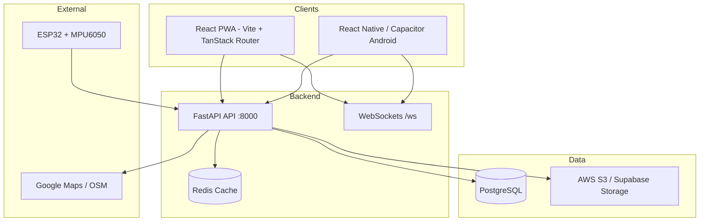

# Roxzave Full-Stack Architecture

## Repositories

| Path | Purpose |
|------|---------|
| `src/` | PWA + Capacitor web bundle |
| `backend/` | FastAPI, SQLAlchemy, WebSockets |
| `android/` | Capacitor native shell |
| `mobile/services/` | RN API service templates |

## Auth Flow

JWT access (30m) + refresh (7d) → `Authorization: Bearer` on all protected routes.

## Real-time

- `/ws/guardian/{user_id}` — live location fan-out
- `/ws/{channel}` — generic pub/sub
