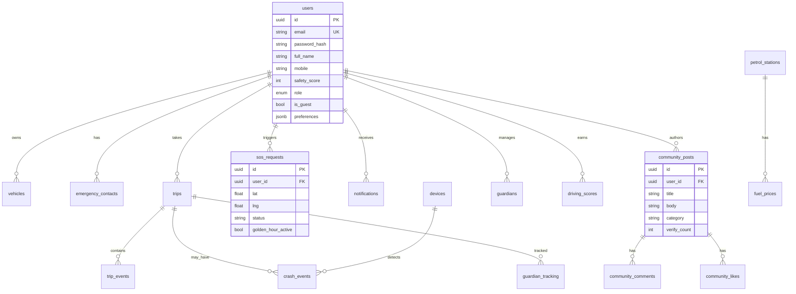

# Roxzave Database ER Diagram

## Indexes

- `users.email`, `users.mobile`
- `trips.user_id`, `trips.started_at`
- `notifications.user_id`, `notifications.is_read`
- `petrol_stations.lat`, `petrol_stations.lng`
- `sos_requests.status`

## Soft deletes

`users`, `vehicles`, `emergency_contacts`, `trips`, `pothole_reports`, `community_posts`, `community_comments` use `deleted_at`.
